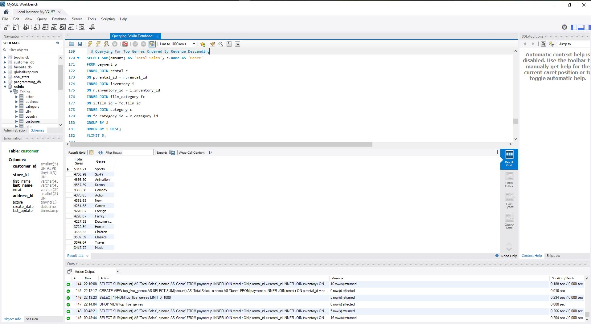
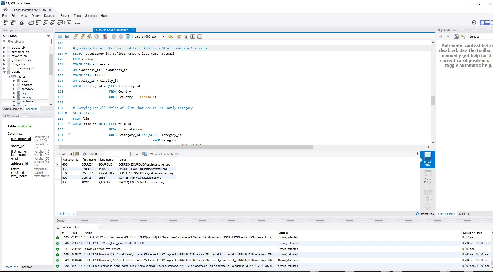

# Project: MySQL - Querying The Sakila Database


There's no better way to learn than to practice. So I took this opportunity to develop MySQL Fundamentals.

### Prerequisites

* MySQL8.0 - https://dev.mysql.com/doc/refman/8.0/en/windows-installation.html

## Installing the Sakila Sample Database

To access the same database I used, you’ll need to load data from a sample database provided by MySQL named [Sakila](https://dev.mysql.com/doc/sakila/en/sakila-installation.html).

If you’re on a PC and used MySQL Installer to install MySQL, you may already have the Sakila database loaded. Before you do anything else, open MySQL workbench and examine the list of databases loaded on your computer:


If the **sakila** DB is on this list, congrats! You can run the following below in MySQL to use the Sakila database:

```sql
use sakila;
```

## Viewing My MySQL Script
* Please click on the "sakila_db_queries.sql" file on the GitHub Site to view. I've also provided a text file of my queries. Otherwise, you can clone or download my repository.

## Sample Output:






## Author

* **Johneson Giang** - *Individual Project* - [Github](https://github.com/jhustles)

## License

This project is licensed under the MIT License - see the [LICENSE.md](LICENSE.md) file for details

